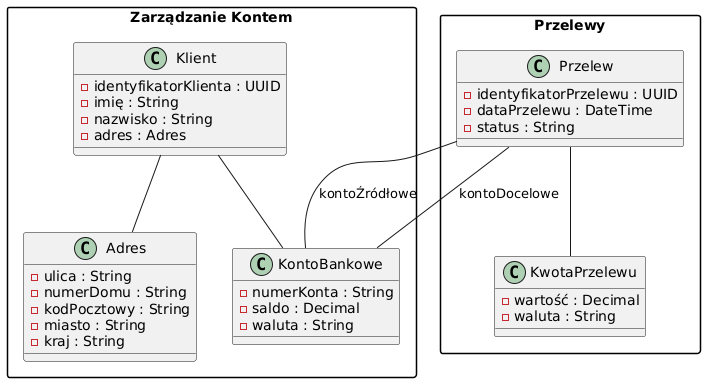

Autor: Szymon Kasperek

## Opis Zadania

Celem zadania jest zamodelowanie fragmentu bezpiecznej aplikacji bankowej z wykorzystaniem zasad Domain Driven Design. Skupiono się na dwóch kontekstach: Zarządzanie Kontem oraz Przelewy. W ramach tych kontekstów zdefiniowano agregaty, encje i obiekty wartości, takie jak KontoBankowe, Przelew, Klient, Adres oraz KwotaPrzelewu.

## Model

## Przyjęte Założenia

### Kontekst: Zarządzanie Kontem

#### Agregat: KontoBankowe

- Atrybuty:
  - numerKonta (String)
    - Unikalny numer konta zgodny z formatem IBAN.
  - właściciel (Klient)
    - Encja reprezentująca właściciela konta.
  - saldo (Decimal)
    - Wartość reprezentujący aktualne saldo konta.
  - waluta (String)
    - Kod waluty konta zgodny z oznaczeniami typu "PLN", "EUR" itd.

#### Encja: Klient

- Atrybuty:
  - identyfikatorKlienta (UUID)
    - Unikalny identyfikator klienta.
  - imię (String)
  - nazwisko (String)
  - adres (Adres)
    - Obiekt wartości zawierający dane adresowe klienta.

#### Obiekt Wartości: Adres

- Atrybuty:
  - ulica (String)
  - numerDomu (String)
  - kodPocztowy (String)
    - Format: "XX-XXX".
  - miasto (String)
  - kraj (String)
    - Predefiniowana lista krajów

### Kontekst: Przelewy

#### Agregat: Przelew

- Atrybuty:
  - identyfikatorPrzelewu (UUID)
    - Unikalny identyfikator przelewu.
  - kontoŹródłowe (KontoBankowe)
    - Konto, z którego jest wykonywany przelew.
  - kontoDocelowe (KontoBankowe)
    - Konto, na które jest wykonywany przelew.
  - kwotaPrzelewu (KwotaPrzelewu)
    - Obiekt wartości reprezentujący kwotę przelewu.
  - dataPrzelewu (DateTime)
    - Data i czas zlecenia przelewu.
  - status (String)
    - Status przelewu (np. "Zlecony", "Zrealizowany", "Odrzucony").

#### Obiekt Wartości: KwotaPrzelewu

- Atrybuty:
  - wartość (Decimal)
    - Kwota przelewu, musi być większa od zera.
  - waluta (String)
    - Kod waluty konta zgodny z oznaczeniami typu "PLN", "EUR" itd.

## Ograniczenia i Operacje

### KontoBankowe

- Ograniczenia:
  - Saldo nie może być ujemne.
  - Numer konta musi być unikalny i zgodny z formatem IBAN.
  - Waluta konta musi być zgodna z walutami obsługiwanymi przez bank.

- Operacje:
  - wpłać(kwota: Kwota)
    - Zwiększa saldo konta o podaną kwotę.
  - wypłać(kwota: Kwota)
    - Zmniejsza saldo konta o podaną kwotę, jeśli saldo na to pozwala.

### Przelew

- Ograniczenia:
  - Kwota przelewu nie może przekraczać dostępnego salda konta źródłowego.
  - Waluty kont źródłowego i docelowego oraz kwoty przelewu muszą być zgodne.
  - Przelew nie może być wykonany na to samo konto.

- Operacje:
  - zlećPrzelew()
    - Inicjuje proces przelewu, zmienia status na "Zlecony".
  - zrealizujPrzelew()
    - Przenosi środki z konta źródłowego na docelowe, zmienia status na "Zrealizowany".
  - anulujPrzelew()
    - Anuluje przelew przed realizacją, zmienia status na "Odrzucony".

### Klient

- Ograniczenia:
  - Pola imię i nazwisko nie mogą być puste i mają ograniczoną minimalną oraz maksymalną ilość znaków.
  - Adres musi zawierać wszystkie wymagane informacje.

- Operacje:
  - Aktualizacja danych osobowych i adresowych.

### Adres

- Ograniczenia:
  - Kod pocztowy musi być w formacie "XX-XXX".
  - Pola ulica, numerDomu, miasto, kraj nie mogą być puste.

- Operacje:
    - Walidacja poprawności danych adresowych.

### KwotaPrzelewu

- Ograniczenia:
  - Kwota musi być liczbą dodatnią.
  - Waluta musi być obsługiwana przez system.

- Operacje:
  - Konwersja walut (jeśli system to obsługuje).
  - Walidacja kwoty i waluty.

## Integracja między Kontekstami

- Zarządzanie Kontem i Przelewy są ze sobą powiązane poprzez agregat KontoBankowe.
- Przelew wykorzystuje informacje o kontach z kontekstu Zarządzania  Kontem do realizacji transakcji.
- Operacje na saldzie konta są wykonywane w ramach transakcji, aby zapewnić integralność danych.